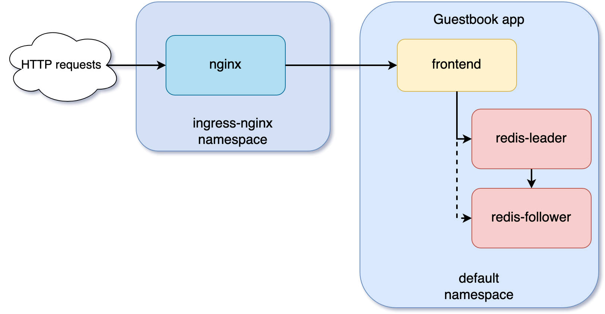

Now, let's deploy a sample app called Guestbook

Guestbook architecture

`kubectl apply -f https://raw.githubusercontent.com/GoogleCloudPlatform/kubernetes-engine-samples/main/guestbook/all-in-one/guestbook-all-in-one.yaml -f ingress.yaml`{{execute}}

Now wait until Guestbook is deployed - all the pods should be **READY** and in **Running** state: `kubectl get pods`{{execute}}

To check out Guestbook open this URL: https://[[HOST_SUBDOMAIN]]-80-[[KATACODA_HOST]].environments.katacoda.com/

Try adding some guestbook entries by typing in a message, and clicking Submit. The message you typed appears in the frontend every time you open the URL.
